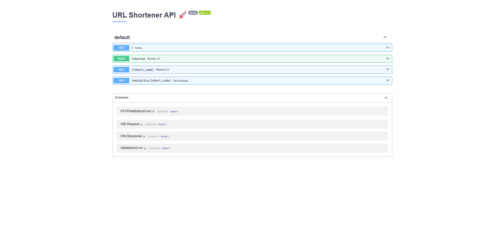
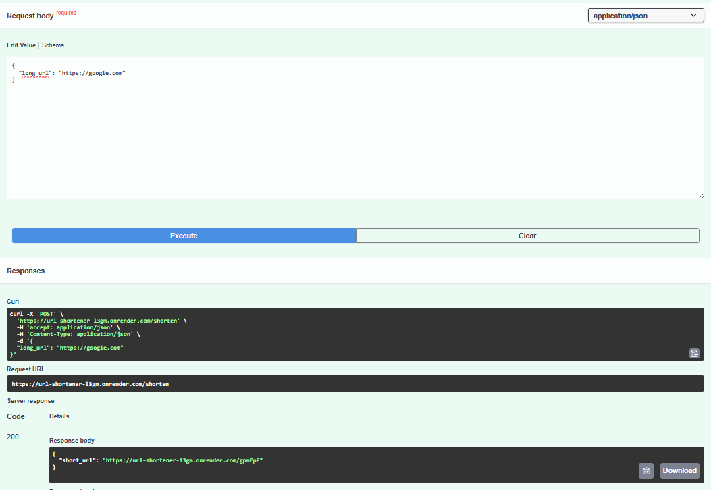

# 🔗 URL Shortener API 🚀

A production-ready URL Shortener built using **FastAPI**, featuring custom short links, analytics tracking, and expiration support.

---

## 🌐 Live Demo

👉 https://url-shortener-l3gm.onrender.com/
👉 Swagger UI: https://url-shortener-l3gm.onrender.com/docs

---

## 🚀 Features

* 🔗 Shorten long URLs instantly
* ✏️ Custom short codes support
* 📊 Click analytics tracking
* ⏳ Optional link expiration
* ⚡ Fast and lightweight API
* 🛡️ Input validation using Pydantic

---

## 🛠️ Tech Stack

* **FastAPI**
* **Python**
* **SQLite**
* **SQLAlchemy**
* **Pydantic**

---

## 📂 Project Structure

```
.
├── main.py
├── requirements.txt
├── swagger.png
├── response.png
├── README.md
```

---

## ⚙️ How It Works

1. User submits a long URL
2. System generates a unique short code
3. Stores mapping in database
4. Redirects using short URL
5. Tracks clicks and analytics

---

## 📌 API Endpoints

### 🔹 Shorten URL

POST `/shorten`

### 🔹 Redirect

GET `/{short_code}`

### 🔹 Analytics

GET `/analytics/{short_code}`

---

## 📷 Preview

### Swagger UI



### API Response



---

## 🚀 Future Improvements

* User authentication system
* Rate limiting
* PostgreSQL integration
* Redis caching

---

## 👨‍💻 Author

**Prasang Jain**

---

## ⭐ Star this repo if you like it!
